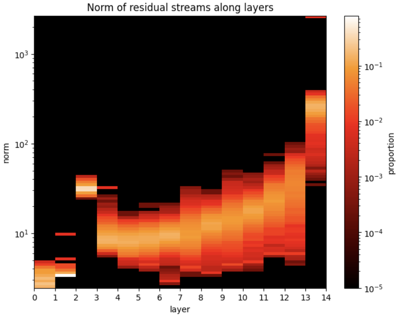

# Normalized Sparse Autoencoders

## Theory

The original architecture of sparse autoencoder (SAE) is: 

$$x' = \text{SAE}(x) = W_d f(x)+b_d$$

where

$$f(x) = \text{ReLU}(W_e x + b_e)$$

and $W_d$ is constrained to be column-normal for optimization purposes.

The loss is calculated as follows:

$$L(x',x)=\alpha||f(x)||_1+||x'-x||_2$$

where $||\cdot||_1$ and $||\cdot||_2$ represents $L_1$ and $L_2$ norms, respectively

Now let's do a theoretical analysis on this loss.

Define $\hat{x}=x/||x||_2$, which is the normalized $x$, then we have

$$||f(x)||_1=||\text{ReLU}(W_e x + b_e)||_1=||x||_2\cdot||\text{ReLU}(W_e \hat{x} + b_e')||_1$$

where $b_e'=b_e/||x||_2$.

Similarly,

$$||x'-x||_2=||x'||_2^2+||x||_2^2-2x'\cdot x=||x||_2^2(\frac{||x'||_2^2}{||x||_2^2}+1-\frac{2x'\cdot x}{||x||_2^2})$$

At first glance, this might not be obvious, but if our reconstruction $x'$ is similar enough to $x$,
we can take $||x'||_2\approx||x||_2$ and the equation simplyfies to 

$$||x'-x||_2=||x||_2^2(1+1-2\frac{x'\cdot x}{||x||_2\cdot||x'||_2})=2||x||_2^2(1-cos(x',x))$$

Now we can rewrite our loss:

$$L(x',x)=\alpha||x||_2\cdot||\text{ReLU}(W_e \hat{x} + b_e')||_1+2||x||_2^2(1-cos(x',x))$$

Notice that, if we mainly care about the direction of $x'$ and the $L_0$ norm as the measure of
sparsity, then the $(1-cos(x',x))$ and $||\text{ReLU}(W_e \hat{x} + b_e')||_1$ terms are more
reflective, while $||x||_2$ serves as a bias term towards high norm tokens. In other words, tokens
with higher norms in a layer generally get higher losses, and the SAEs fits them better than tokens
with lower norms.

## Observations in LLMs

Now, you may ask, does this really matter?

In fact, it does. Firstly, the norm of residuals are NOT from uniform in large language models
(LLMs). Here is a plot showing the norm distribution of residual states across the 12 layers of
GPT2-small:

    

Clearly you can notice that, within a single layer the norms are vastly different, and these norms
also vary across layers.

The consequence of this effect is twofolds:

1. Within one layer, SAE will bias residuals with high norms, especially when norms grows above $10^2$.
2. Across layers, since the $L_1$ loss has a factor of $||x||_2$ while the $L_2$ loss has a factor
   of $||x||_2^2$, the change in norm will bias towards one of the loss terms, effectively making $\alpha$
   different across layers. So we should consider using **different** $\alpha$ in **different** layers.

## Experiments with SAEs

Let's investigate the feature activation corresponding to the top 1% residual states in terms of
their norms. Here are the $L_0$ and $L_1$ norms of the feature activations:

    

    

This does not look like things are working properly :(

It turns out, these high norm tokens corresponds to residual states from the `<|endoftext|>` token.
They are pretty uninterpretable and are less monosemantic. Hence, it might be beneficial to reduce
the loss of these high norm tokens to allow the model to pick up more information from other tokens.

Another relevant observation is [Feature
Suppression](https://www.lesswrong.com/posts/3JuSjTZyMzaSeTxKk/addressing-feature-suppression-in-saes),
where feature of smaller activations are completely killed during the training process. The
residual states with large norms has a quadratic effect on the $L_2$ loss, and a linear relationship
with the $L_1$, dominating the loss terms and suppressed the smaller residuals.

## Quick fixes

We can change the model architecture a bit.

### Normalization by encoder activation

Define the **Normalized SAE**

$$\text{SAE}_{\text{N}}(x)=W_d(\text{act}(W_ex+b_e))+b_d$$

where we no longer constrain $W_d$ to be column normal and let
$\text{act}(x)=\text{tanh}(\text{ReLU}(x))$, then the activation looks like this:

    

The purpose of this is to constrain feature activations to the range $(0,1)$, so the $L_1$
norm will not explode for high-norm residuals. We can still learn the reconstruction with a non-unit
norm decoder, and use it as a feature dictionary that contains information on the norm of residual
states.

This is implemented and you can set the autoencoder hyperparameter `sae_type={"none"|"normalized_sae"}` to
use it.

## Adding small perturbations before applying activation

However, only applying this activation does not work, as the model can learn to minimize $L_1$ by scaling the
feature activation to a very small magnitude and make the norm of vectors in the decoder dictionary
very large (also discussed in [the original SAE paper](https://arxiv.org/pdf/2309.08600.pdf) page 3
footnote 3).

We can get around this by adding small perturbation to the encoder before activation:

$$\text{Encoder}(x)=\text{act}(W_ex+b_e+\epsilon)$$

where $\epsilon\sim\mathcal{N}(0,\sigma)$ with $\sigma$ as a hyperparameter to control the noise
scale.

In this way, $W_ex+b_e$ will not converge to small positive values as small values are sensitive to
perturbation. The encoder is encouraged to learn $W_ex+b_e$ of larger magnitude at each entry,
either positive or negative, which after activation becomes $0$ or close to $1$. This is a great
thing as this makes the $L_1$ loss to be very close to $L_0$, which better indicates sparsity.

### Normalization of $L_2$ loss

Now that we have dealt with the $L_1$ loss, what about the $L_2$ term? This can be more complicated.
Depending on our goals, we can choose to divide the $L_2$ loss by $||x||_2^2$, or leave it as
is. The prior eliminates the bias towards high-norm residuals, while the latter assumes residual
states with higher norms are more important than those of lower norms. There is also a third option
to normalize the $L_2$ by dividing with $||x||_2$, which leaves $L_2$ to grow linearly with
$||x||_2$ and prevents it from exploding as norms grows larger than $10^2$. I will denote the
regular $L_2$, $L_2/||x||_2$, and $L_2/||x||_2^2$ as $L_2$, $L_2^1$, and $L_2^2$, respectively.

This is implemented and you can set the loss hyperparameter
`normalization_method={"none"|"input_norm"|"input_norm_squared"}` to use it.

### Adjusting $\alpha$

After the adjustment, our loss is now

$$L(x',x)=\alpha||\text{tanh}(\text{ReLU}(W_e \hat{x} + b_e'))||_1+2||x||_2^k(1-cos(x',x))$$

for $k\in\set{0,1,2}$ corresponding to $L_2^2$, $L_2^1$, and $L_2$, respectively.

Now, remember that the norm of residual states is not uniform across layers as well, but there is an
imbalance between the $L_1$ term and $L_2$ term: The $L_1$ is of the scale `hidden_state_size` *
`expansion_factor`, which is constant, while the $L_2$ term is of the scale $||x||_2^k$ which is not
constant across layers when $k \neq 0$. Hence, if we use the same $L_1$ coefficient $\alpha$ across
layers, there will be some layers where $L_1$ dominates and some layers where reconstruction dominates.

There is also a (rather) simple way to fix this:

First collect a sample of residual states and calculate the norm of these states of every layer,
denoted as $\set{n_i}$ for $i$ as the layer indices. Then take 

$$L_i(x',x)=\beta_i||\text{tanh}(\text{ReLU}(W_e \hat{x} + b_e'))||_1+2||x||_2^k(1-cos(x',x))$$

where

$$\beta_i=\alpha n_i^k$$

Then we will have a global factor $\alpha$ that controls the sparsity-reconstruction tradeoff, and
in each layer the actual $L_1$ coefficient is calculated in consideration of the average residual
norm to ensure cross-layer consistency. I will denote the original approach and this modified
approach as $\alpha$- and $\beta$-coeff, respectively.

**NOTE**: $\beta$-coeff NOT YET IMPLEMENTED

## Training

We will do experiments under the following 12 (2 * 3 * 2)conditions:

{ $\text{SAE}$ | $\text{SAE}_\text{N}$ } + { $L_2$ | $L_2^1$ | $L_2^2$ } + { $\alpha$- | $\beta$-coeff }

TODO:

|$\alpha$                 |      $L_2$     |    $L_2^1$    |    $L_2^1$    |
|:------------------------|:--------------:|:-------------:|:-------------:|
|**$\text{SAE}$**         |         |        |
|**$\text{SAE}_\text{N}$**|         |        |

|$\beta$                  |      $L_2$     |    $L_2^1$    |    $L_2^1$    |
|:------------------------|:--------------:|:-------------:|:-------------:|
|**$\text{SAE}$**         |         |        |
|**$\text{SAE}_\text{N}$**|         |        |

## Related works

[Feature Suppression](https://www.lesswrong.com/posts/3JuSjTZyMzaSeTxKk/addressing-feature-suppression-in-saes)